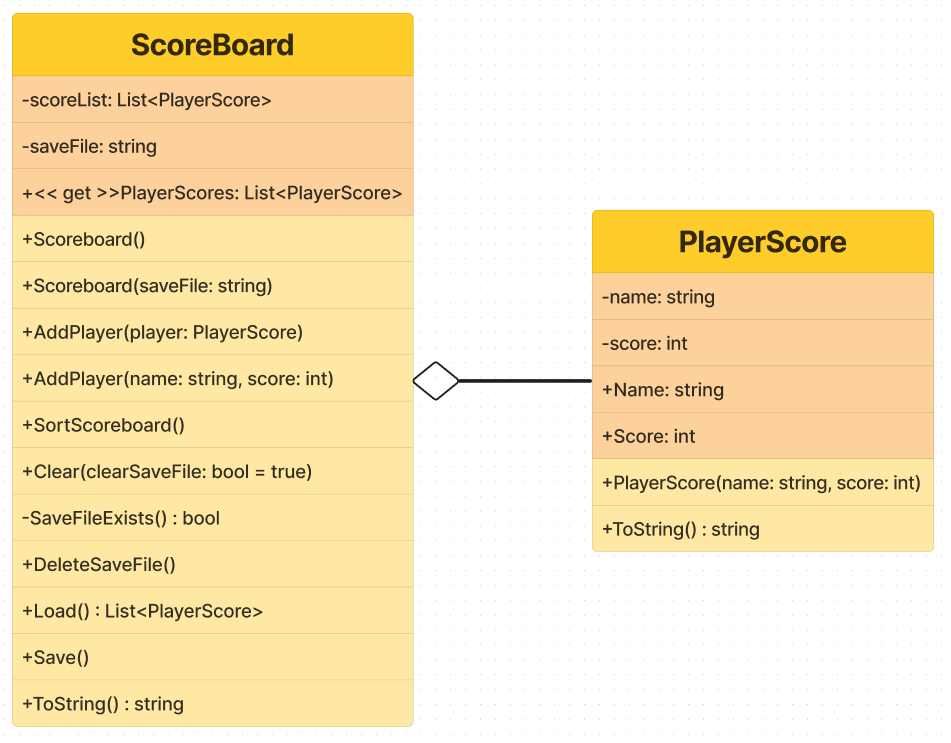

# QuizApp

## Project description: 
A Multiple Choice Quiz app made in C# with wpf GUI.
The questions are fetched with API's from https://the-trivia-api.com/.
There is also an console app version (ConsoleQuizApp).

## Author:
Verstraete Domien
ICT-electronics student at Vives Brugge

## Screenshots: 
### console

### welcome

### about page

### quiz 

### correct / incorrect

### scoreboard

## Setup and Usage: 
### For Development
1) Visual Studio

Description: A powerful integrated development environment (IDE) used for developing .NET applications, including Windows Presentation Foundation (WPF) applications.
Download: [Visual Studio](https://visualstudio.microsoft.com/)

2) .NET SDK

Description: Software development kit required to build and run .NET applications.
Download: [.NET SDK](https://dotnet.microsoft.com/download)

### For Running the Application

1) .NET Runtime

- Description: The runtime required to run .NET applications. This is necessary if you are distributing the application as a standalone executable.
- Download: [.NET Runtime](https://dotnet.microsoft.com/download/dotnet)

### Additional Tools

1) Git

- Description: A version control system to manage your source code.
- Download: [Git](https://git-scm.com/)

2) GitHub Account (optional)

- Description: To host and share your source code, and manage version control.
- Sign Up: [GitHub](Uhttps://github.com/)

### Summary
- Development: Visual Studio, .NET SDK
- Running the App: .NET Runtime
- Additional Tools: Git, GitHub account (optional)

These tools are essential for both developing and running the quiz application effectively.

## UML diagrams of the classes in the library
### Questionnaire Library

### ScoreBoard Library

## Future Improvements: 
- login for returing users
- keeping track of the time users take to finish the quiz
- being able to see the scoreboard in the beginning of the app
- adding question photos
- adding the option to choose a topic for the questions
- Lan party versus battle